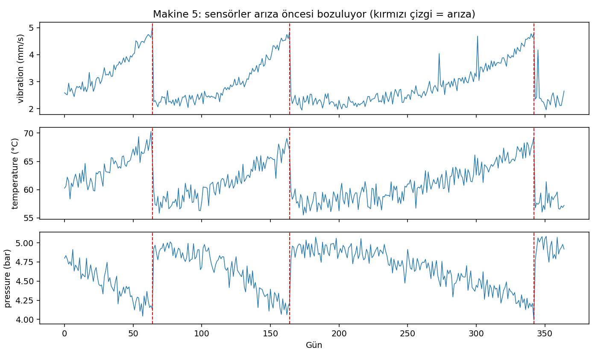
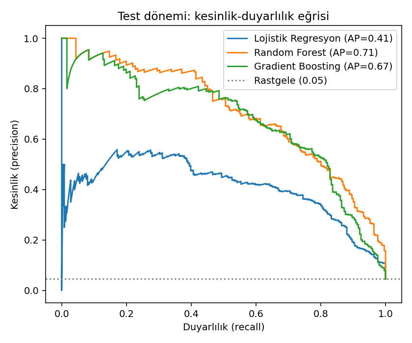
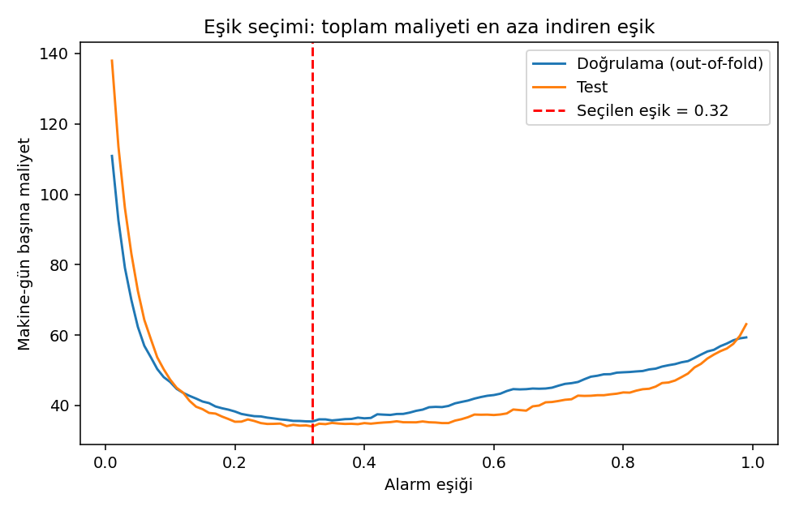
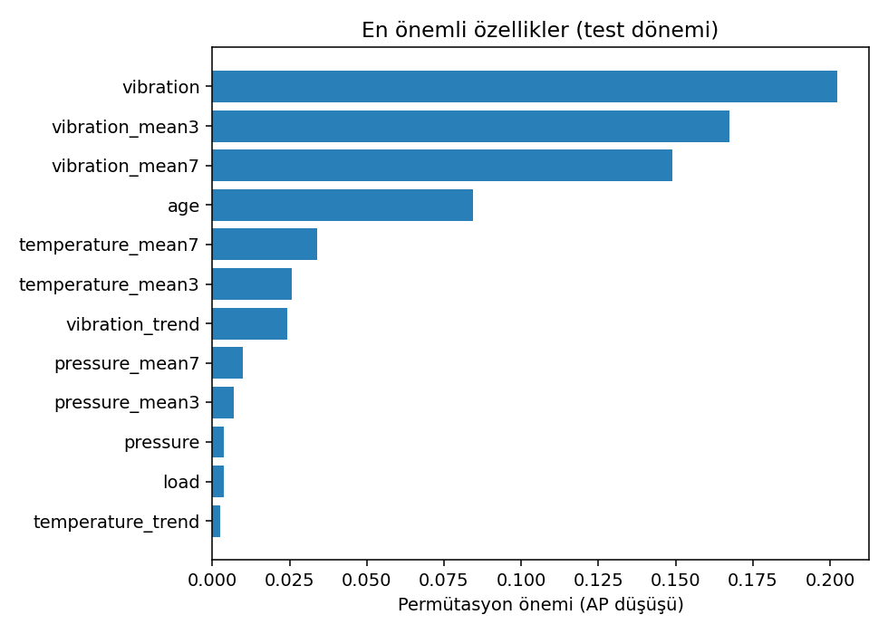
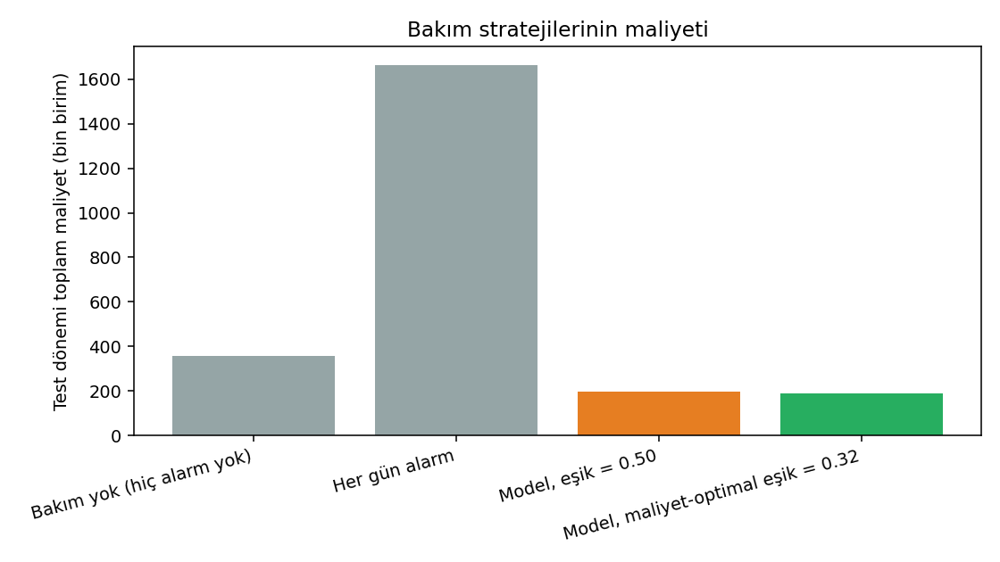

# Makine Arıza Tahmini ve Maliyet Odaklı Bakım

**Sensör verilerinden 7 günlük arıza riskini tahmin eden ve bakım kararını işletme maliyetine göre optimize eden uçtan uca kestirimci bakım projesi.**

## Proje Özeti

Bu çalışma, 60 makinenin 365 günlük titreşim, sıcaklık, basınç ve yük verisini kullanarak şu soruya yanıt verir:

> Bir makine önümüzdeki 7 gün içinde arızalanacak mı?

Proje yalnızca model doğruluğuna odaklanmaz. Yanlış alarmın ve kaçırılan arızanın parasal etkisini hesaba katarak **en düşük beklenen maliyeti üreten alarm eşiğini** seçer.

## Öne Çıkan Sonuçlar

Test dönemi 5.543 makine-gün ve 251 pozitif gözlem içerir.

| Strateji | Alarm | Recall | Precision | Toplam maliyet |
|---|---:|---:|---:|---:|
| Bakım yok | 0 | 0,00 | - | 358.930 |
| Her gün alarm | 5.543 | 1,00 | 0,05 | 1.662.900 |
| Model, eşik 0,50 | 270 | 0,68 | 0,63 | 195.400 |
| **Model, maliyet-optimal eşik 0,32** | **362** | **0,78** | **0,54** | **188.680** |

**Maliyet-optimal politika, bakım yapılmayan senaryoya göre toplam maliyeti yaklaşık %47 azaltır.**

## Görsel Sonuçlar

  

<table>
  <tr>
    <td align="center"><strong>Precision-Recall Eğrileri</strong></td>
    <td align="center"><strong>Eşik-Maliyet İlişkisi</strong></td>
  </tr>
  <tr>
    <td></td>
    <td></td>
  </tr>
  <tr>
    <td align="center"><strong>Özellik Önemleri</strong></td>
    <td align="center"><strong>Strateji Maliyetleri</strong></td>
  </tr>
  <tr>
    <td></td>
    <td></td>
  </tr>
</table>

## Analitik Akış

<pre>
Ham sensör verisi
       |
       v
Zaman serisi özellikleri
(3/7 günlük ortalama, std, trend, makine yaşı)
       |
       v
Zaman bazlı ve sızıntısız doğrulama
       |
       v
LR / Random Forest / Gradient Boosting
       |
       v
Out-of-fold olasılık tahminleri
       |
       v
Maliyet-optimal alarm eşiği
       |
       v
Test dönemi performansı ve bakım kararı
</pre>

## Modelleme Yaklaşımı

### Özellik mühendisliği

- Titreşim, sıcaklık, basınç ve yük için 3 ve 7 günlük hareketli ortalamalar
- 7 günlük standart sapma
- Kısa ve uzun dönem ortalamaları arasındaki fark
- Makine yaşı
- Bakım sonrasında sıfırlanan kayan pencereler

### Sızıntısız doğrulama

Etiket gelecekteki 7 güne baktığı için rastgele train-test bölmesi veri sızıntısına yol açabilir. Bu projede:

- Eğitim ve test dönemleri zamana göre ayrılır.
- Genişleyen pencereli çapraz doğrulama kullanılır.
- Eğitim ve doğrulama arasına HORIZON kadar boşluk bırakılır.
- Karar eşiği yalnızca eğitim döneminin out-of-fold tahminlerinden seçilir.

### Dengesiz sınıf yönetimi

Pozitif sınıf oranı yaklaşık %3,7 olduğu için accuracy yanıltıcıdır. Ana model karşılaştırma metriği **PR-AUC**'dir ve sınıf ağırlıkları kullanılır.

| Model | CV PR-AUC |
|---|---:|
| Lojistik Regresyon | 0,44 |
| **Random Forest** | **0,52** |
| Gradient Boosting | 0,51 |

## Maliyet Modeli

Karar birimi bir makine-gündür.

| Olay | Varsayılan maliyet |
|---|---:|
| Plansız arıza | 10.000 |
| Kaçırılan pozitif makine-gün | yaklaşık 1.430 |
| Alarm / denetim | 300 |

Parametreler **src/modeling.py** içindeki COST_MISSED ve COST_ALARM sabitlerinden işletmeye göre değiştirilebilir.

## Hızlı Başlangıç

    git clone https://github.com/hasancrty/predictive-maintenance-failure-prediction.git
    cd predictive-maintenance-failure-prediction
    python -m venv .venv

    # Windows: .venv\Scripts\activate
    # macOS/Linux: source .venv/bin/activate

    pip install -r requirements.txt
    python -m src.run
    python -m pytest -q

Model çıktıları ve grafikler **outputs/** klasörüne yazılır.

## Kendi Verinizle Kullanma

**data/sensor_data.csv** dosyasını aşağıdaki şemayla değiştirin:

| Kolon | Açıklama |
|---|---|
| machine_id | Makine kimliği |
| day | Gözlem tarihi veya gün indeksi |
| vibration | Titreşim ölçümü |
| temperature | Sıcaklık ölçümü |
| pressure | Basınç ölçümü |
| load | Makine yükü |
| failure | Arıza günü için 1, aksi halde 0 |

Farklı sensörler kullanıldığında **src/features.py** içindeki SENSORS listesi güncellenmelidir.

## Çıktılar

| Dosya | İçerik |
|---|---|
| outputs/model_comparison.csv | Modellerin çapraz doğrulama performansı |
| outputs/strategy_costs.csv | Bakım stratejilerinin maliyet ve performansı |
| outputs/feature_importance.csv | Seçilen modelin değişken önemleri |
| outputs/pr_curves.png | Precision-recall eğrileri |
| outputs/threshold_cost.png | Eşik değerine göre toplam maliyet |
| outputs/strategy_costs.png | Strateji bazında maliyet karşılaştırması |

## Proje Yapısı

<pre>
.
|-- data/                 # Günlük sensör ve arıza verisi
|-- outputs/              # Model tabloları ve grafikler
|-- src/
|   |-- features.py       # Sızıntısız zaman serisi özellikleri
|   |-- generate_data.py  # Sentetik makine verisi üretimi
|   |-- modeling.py       # Eğitim, doğrulama ve maliyet optimizasyonu
|   +-- run.py            # Uçtan uca çalışma akışı
|-- tests/                # Veri ve modelleme testleri
+-- requirements.txt
</pre>

## Sınırlamalar ve Geliştirme Alanları

- Aynı arıza öncesindeki ardışık alarmlar ayrı maliyetlendirilir; olay bazlı maliyet modeli eklenebilir.
- Hayatta kalma analizi ile kalan faydalı ömür (RUL) tahmini yapılabilir.
- SHAP ile tekil alarm açıklamaları üretilebilir.
- Bakım ekibi kapasitesi ve yedek parça kısıtları karar modeline eklenebilir.
- Sonuçlar sentetik veriye aittir; üretim kullanımı öncesinde gerçek saha verisiyle yeniden kalibrasyon gerekir.

---

Bu proje, makine öğrenmesi performansını doğrudan operasyonel bakım maliyetine bağlayan bir karar destek örneğidir.
